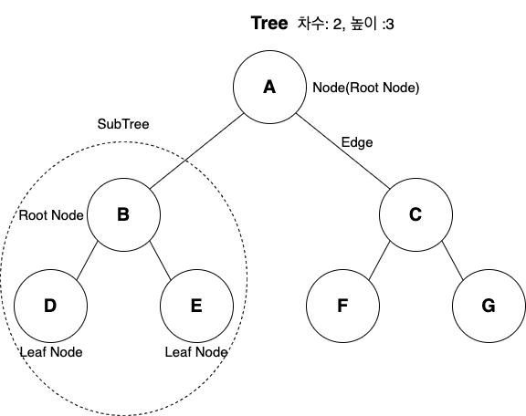

# Tree
자바에서 Stack이나 Queue같이 지원하는지는 정확히 모르겠다... 
**트리 종류**
- 자식을 2개만 가지는 이진트리 
- 자식의 개수가 2개보다  일반트리 (B-Tree, B+Tree...)

여기서는 이진트리만를 주로 다루기로 하겠습니다

## Tree란...
List, Stack, Queue는 선형적인 구조를 가지고 있다 
하지만 데이터가 계층적 구조를 가지고 있다면 선형 구조로는 표현이 불가능하다 
계층적 데이터를 표현하기 위해서 사용되는 것이 **Tree**이다

### Tree 용어 정리
- Node : 트리의 구성 요소
- Edge : 노드와 노드 사이를 이어주는 선
- Root Node : 트리나 서브 트리에서 최상위 노드
- Leaf Node : 트리에서 최하단의 다른 노드를 가지지 않는 노드
- Parent Node : A는 B의 Parent Node 이다
- Sibling Node : B는 A의 Sibling Node 이다
- 차수 : 한 Node가 가지고 있는 자식의 개수
- 높이 : 트리의 레벨 값중 제일 큰 값
- 레벨 : 최상위 노드서 부터 최하단 노드까지 (1 ~ N)

## Tree Interface

